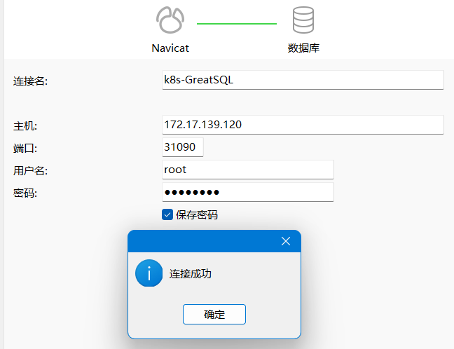

# 第七章 Deployment 介绍

## 一、什么是 Deployment
Deployment提供了一种更简单的方式来更新Replica Set和Pod，以更好地解决Pod编排的问题。

通过Deployment，只需要描述期望的目标状态，Deployment控制器将会将实际的Pod和Replica Set状态改变为目标状态。可以通过定义一个全新的Deployment来创建一个新的Replica Set，或者删除现有的Deployment并创建一个新的来替换旧的Deployment。这种方式使得更新和管理Pod的过程更加简单和灵活。

## 二、Deployment 基本概念
当你在Kubernetes中部署容器化应用时，Deployment是一个非常重要的对象。Deployment对象可以帮助你实现容器化应用的渐进式部署、回滚以及伸缩。以下是Deployment的基本概念：

- **Deployment**是Kubernetes中的一个对象，它可以帮助你管理Pod的创建和更新。Deployment对象使用声明式语法来描述所需的Pod状态，并确保当前状态与所需状态匹配。如果当前状态与所需状态不匹配，则Deployment会自动更新Pod以使其与所需状态匹配。

- **ReplicaSet**是Deployment的一部分，它可以帮助你确保Pod的数量符合预期。ReplicaSet使用声明式语法来描述所需的Pod副本数，并确保当前状态与所需状态匹配。如果当前状态与所需状态不匹配，则ReplicaSet会自动更新Pod以使其与所需状态匹配。

- **Pod**是Kubernetes中的最小部署单元，它可以包含一个或多个容器。Pod是由Kubernetes调度程序创建和管理的，它们可以在同一节点上运行，也可以在不同节点上运行。Pod可以共享存储和网络资源，并且它们可以通过容器之间的IPC通信进行交互。

- **控制器**是Kubernetes中的一个对象，它可以帮助你确保所需的Pod状态与当前状态匹配。Deployment和ReplicaSet都是控制器的示例。控制器使用声明式语法来描述所需的Pod状态，并确保当前状态与所需状态匹配。如果当前状态与所需状态不匹配，则控制器会自动更新Pod以使其与所需状态匹配。

## 三、部署单实例无状态 GreatSQL
在学习初期可以用Deployment部署一个单实例无状态GreatSQL作为尝试

为了方便大家学习我把所有yaml配置文件存放到仓库中GreatSQL-K8S-Config/greatsql-deployment目录下
- Service
  - [greatsql-deployment-service.yaml](../GreatSQL-K8S-Config/greatsql-deployment/greatsql-deployment-service.yaml)
- ConfigMap
  - [greatsql-deployment-configmap.yaml](../GreatSQL-K8S-Config/greatsql-deployment/greatsql-deployment-configmap.yaml)
- PersistentVolume & PersistentVolumeClaim
  - [greatsql-deployment-pv.yaml](../GreatSQL-K8S-Config/greatsql-deployment/greatsql-deployment-pv.yaml)
- Deployment
  -  [greatsql-deployment.yaml](../GreatSQL-K8S-Config/greatsql-deployment/greatsql-deployment.yaml)


首先我们创建一个文件夹用于存放这些配置文件
```bash
$ mkdir -p /opt/k8s/greatsql-deployment
$ cd /opt/k8s/greatsql-deployment
```

接着就可以创建Service

```bash
$ vim greatsql-deployment-service.yaml

apiVersion: v1
kind: Service
metadata:
  name: greatsql-sv
spec:
  ports:
  - port: 9000
    protocol: TCP
    targetPort: 3306
    nodePort: 31090
  selector:
    app: greatsql
  type: NodePort
```
创建ConfigMap

```bash
$ vim greatsql-deployment-configmap.yaml

apiVersion: v1
kind: ConfigMap
metadata:
  name: greatsql-config
data:
  my.cnf: |
    [mysql]
    loose-skip-binary-as-hex
    prompt="(\\D)[\\u@GreatSQL][\\d]> "
    no-auto-rehash
    [mysqld]
    character-set-server = UTF8MB4
    skip_name_resolve = 1
    # 若你的GreatSQL数据库主要运行在境外,请务必根据实际情况调整本参数
    default_time_zone = "+8:00"
    innodb_buffer_pool_size = 128M
    innodb_buffer_pool_instances = 8
    innodb_data_file_path = ibdata1:12M:autoextend
    innodb_flush_log_at_trx_commit = 1
    innodb_log_buffer_size = 32M
    innodb_doublewrite_files = 2
    innodb_max_undo_log_size = 4G
    # 可自行继续添加
```
创建PersistentVolume & PersistentVolumeClaim

```bash
$ vim greatsql-deployment-pv.yaml

apiVersion: v1
kind: PersistentVolume
metadata:
  name: greatsql-pv-volume
  labels:
    type: local
spec:
  storageClassName: manual
  capacity:
    storage: 20Gi
  accessModes:
    - ReadWriteOnce
  hostPath:
    path: /data/GreatSQL
---
apiVersion: v1
kind: PersistentVolumeClaim
metadata:
  name: greatsql-pv-claim
spec:
  storageClassName: manual
  accessModes:
    - ReadWriteOnce
  resources:
    requests:
      storage: 20Gi
```
创建Deployment
```bash
$ vim greatsql-deployment.yaml

apiVersion: apps/v1
kind: Deployment
metadata:
  name: greatsql
  labels:
    type: app
    version: GreatSQL8.0.32-24
spec:
  selector:
    matchLabels:
      app: greatsql
  strategy:
    type: Recreate
  template:
    metadata:
      labels:
        app: greatsql
    spec:
      containers:
        - image: greatsql/greatsql:8.0.32-24
          name: greatsql
          imagePullPolicy: IfNotPresent
          env:
            - name: MYSQL_ROOT_PASSWORD
              value: "greatsql"
          ports:
            - containerPort: 3306
              name: greatsql
          volumeMounts:
            - name: greatsql-persistent-storage
              mountPath: /data/GreatSQL
            - mountPath: /etc/mysql
              name: conf-volume
              readOnly: true
      volumes:
        - name: conf-volume
          configMap:
            name: greatsql-config
            items:
              - key: my.cnf
                mode: 0644
                path: my.cnf
        - name: greatsql-persistent-storage
          persistentVolumeClaim:
            claimName: greatsql-pv-claim
```
使用`$ kubectl apply -f`创建

```bash
$ kubectl apply -f greatsql-deployment-service.yaml
$ kubectl apply -f greatsql-deployment-configmap.yaml
$ kubectl apply -f greatsql-deployment-pv.yaml
$ kubectl apply -f greatsql-deployment.yaml
```
查看一下创建情况
```bash
$ kubectl get deployment
NAME       READY   UP-TO-DATE   AVAILABLE   AGE
greatsql   1/1     1            1           34s

$ kubectl get po   
NAME                        READY   STATUS    RESTARTS   AGE
greatsql-68dd978b97-b6f8s   1/1     Running   0          12s
```
可以使用kubectl exec -it加Pod的NAME进入容器
```bash
$ kubectl exec -it greatsql-68dd978b97-b6f8s -- bash
```
登入GreatSQL查看版本号
```bash
$ mysql -uroot -pgreatsql

greatsql>\s       
--------------
mysql  Ver 8.0.32-24 for Linux on x86_64 (GreatSQL (GPL), Release 24, Revision c2e83f27394)

Connection id:          9
Current database:       
Current user:           root@localhost
SSL:                    Not in use
Current pager:          stdout
Using outfile:          ''
Using delimiter:        ;
Server version:         8.0.32-24 GreatSQL (GPL), Release 24, Revision c2e83f27394
Protocol version:       10
Connection:             Localhost via UNIX socket
Server characterset:    utf8mb4
Db     characterset:    utf8mb4
Client characterset:    utf8mb4
Conn.  characterset:    utf8mb4
UNIX socket:            /data/GreatSQL/mysql.sock
Uptime:                 6 min 3 sec

Threads: 2  Questions: 8  Slow queries: 0  Opens: 118  Flush tables: 3  Open tables: 35  Queries per second avg: 0.022
--------------
```
也可以使用第三方工具连接GreatSQL


## 四、测试GreatSQL Pod
我们在GreatSQL Pod中创建一个数据库并写入一些数据
```bash
greatsql> CREATE DATABASE test;

greatsql> USE test;

greatsql> CREATE TABLE k8s_table (
    id INT AUTO_INCREMENT PRIMARY KEY,
    name VARCHAR(255),
    age INT,
    email VARCHAR(255),
    city VARCHAR(255)
);

greatsql> INSERT INTO k8s_table (name, age, email, city) VALUES
('John Doe', 30, 'john@example.com', 'New York'),
('Jane Smith', 25, 'jane@example.com', 'Los Angeles'),
('Bob Johnson', 40, 'bob@example.com', 'Chicago'),
('Alice Brown', 28, 'alice@example.com', 'San Francisco'),
('Michael Wilson', 35, 'michael@example.com', 'Seattle'),
('Emily Davis', 32, 'emily@example.com', 'Boston'),
('David Lee', 29, 'david@example.com', 'Houston'),
('Sarah Miller', 27, 'sarah@example.com', 'Atlanta'),
('Kevin Anderson', 38, 'kevin@example.com', 'Denver'),
('Laura White', 31, 'laura@example.com', 'Miami');

greatsql> select * from k8s_table;
+----+----------------+------+---------------------+---------------+
| id | name           | age  | email               | city          |
+----+----------------+------+---------------------+---------------+
|  1 | John Doe       |   30 | john@example.com    | New York      |
|  2 | Jane Smith     |   25 | jane@example.com    | Los Angeles   |
|  3 | Bob Johnson    |   40 | bob@example.com     | Chicago       |
|  4 | Alice Brown    |   28 | alice@example.com   | San Francisco |
|  5 | Michael Wilson |   35 | michael@example.com | Seattle       |
|  6 | Emily Davis    |   32 | emily@example.com   | Boston        |
|  7 | David Lee      |   29 | david@example.com   | Houston       |
|  8 | Sarah Miller   |   27 | sarah@example.com   | Atlanta       |
|  9 | Kevin Anderson |   38 | kevin@example.com   | Denver        |
| 10 | Laura White    |   31 | laura@example.com   | Miami         |
+----+----------------+------+---------------------+---------------+
10 rows in set (0.00 sec)
```
此时我们把GreatSQL Pod容器删除
```bash
$ kubectl get po
NAME                        READY   STATUS    RESTARTS   AGE
greatsql-68dd978b97-cpb9q   1/1     Running   0          10m

$ kubectl delete po greatsql-68dd978b97-cpb9q
#这里会停顿一下下，因为有新的容器在创建
pod "greatsql-68dd978b97-cpb9q" deleted

# 整个流程如下
$ kubectl get pods -w
NAME                        READY   STATUS    RESTARTS   AGE
greatsql-68dd978b97-dsb6c   1/1     Running   0          119s
greatsql-68dd978b97-dsb6c   1/1     Terminating   0          2m33s
greatsql-68dd978b97-4cf9g   0/1     Pending       0          0s
greatsql-68dd978b97-4cf9g   0/1     Pending       0          0s
greatsql-68dd978b97-4cf9g   0/1     ContainerCreating   0          0s
greatsql-68dd978b97-4cf9g   0/1     ContainerCreating   0          1s
greatsql-68dd978b97-dsb6c   1/1     Terminating         0          2m35s
greatsql-68dd978b97-dsb6c   0/1     Terminating         0          2m35s
greatsql-68dd978b97-dsb6c   0/1     Terminating         0          2m35s
greatsql-68dd978b97-dsb6c   0/1     Terminating         0          2m35s
greatsql-68dd978b97-4cf9g   1/1     Running             0          3s
```
我们进入新的Pod中看看数据是否还在
```bash
$ kubectl exec -it greatsql-68dd978b97-4cf9g -- bash

$ mysql -uroot -pgreatsql

greatsql> select * from test.k8s_table;
+----+----------------+------+---------------------+---------------+
| id | name           | age  | email               | city          |
+----+----------------+------+---------------------+---------------+
|  1 | John Doe       |   30 | john@example.com    | New York      |
|  2 | Jane Smith     |   25 | jane@example.com    | Los Angeles   |
|  3 | Bob Johnson    |   40 | bob@example.com     | Chicago       |
|  4 | Alice Brown    |   28 | alice@example.com   | San Francisco |
|  5 | Michael Wilson |   35 | michael@example.com | Seattle       |
|  6 | Emily Davis    |   32 | emily@example.com   | Boston        |
|  7 | David Lee      |   29 | david@example.com   | Houston       |
|  8 | Sarah Miller   |   27 | sarah@example.com   | Atlanta       |
|  9 | Kevin Anderson |   38 | kevin@example.com   | Denver        |
| 10 | Laura White    |   31 | laura@example.com   | Miami         |
+----+----------------+------+---------------------+---------------+
10 rows in set (0.02 sec)
```

数据并没有丢失一直保存，但是注意，如果node1节点整体坏了，那么数据也就丢失了

---

至此,我们完成了单实例GreatSQL的部署，虽可运行但尚不适用于生产。

## 参考资料

- [Docker与Kubernetes容器运维实战](https://baike.baidu.com/item/Docker与Kubernetes容器运维实战/63475077?fr=ge_ala)

## 免责声明

因个人水平有限，专栏中难免存在错漏之处，请勿直接复制文档中的命令、方法直接应用于线上生产环境。请读者们务必先充分理解并在测试环境验证通过后方可正式实施，避免造成生产环境的破坏或损害。

## 联系我们
---
扫码关注微信公众号


